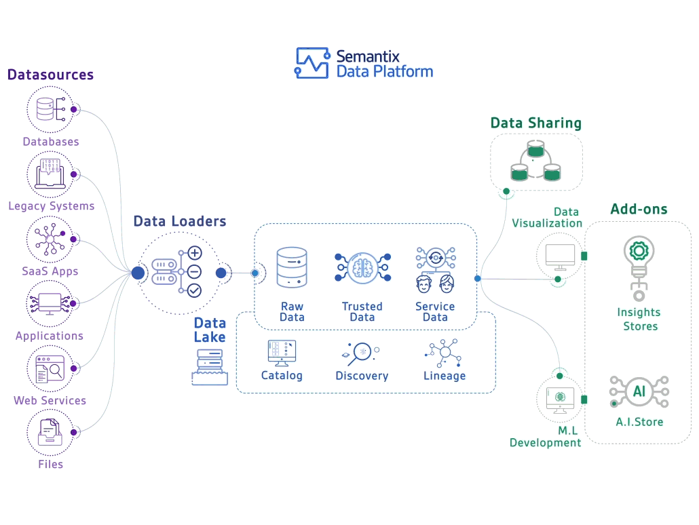

# Big Data Distributed System

This is a guide to build a powerful, scalable, and flexible distributed big data system, including Data Warehouse, Data Lake, and ETL tools like Airflow, Spark, HDFS, Hive, and Superset.



## Objective
The goal of this project is to create a distributed data system capable of processing and analyzing large datasets from multiple sources and providing comprehensive reporting and data visualization for end-users.

## Components

### 1. Data Lake and Data Warehouse
- The Data Warehouse serves as the storage for processed and ready-to-query data. In this project, we utilize an open-source Data Warehouse system like Apache Hive to build this storage layer.

- The Data Lake is the storage for raw and unstructured data from various sources. We employ the Hadoop Distributed File System (HDFS) to implement the Data Lake in this project.

### 2. ETL (Extract, Transform, Load)
The ETL process is responsible for extracting data from sources, transforming it, and loading it into the Data Warehouse and Data Lake. In this project, we utilize the following tools:

- Apache Airflow: Manages scheduling, automation, and monitoring of ETL workflows.
- Apache Spark: Processes large datasets and performs complex transformations.
- Apache Hive: Executes queries and transformations within the Data Warehouse.
- HDFS: Stores raw data in the Data Lake.

### 3. Data Visualization
Reporting and data visualization are essential for understanding information from the data. In this project, we use Apache Superset to create reports and visualize data.

## General Guide for Building and Deploying Big Data Services
### Part One: Building Docker Images
1. Clone the repository:

    ```sh
    git clone https://github.com/dnguyenngoc/big-data.git
    cd big-data
    ```
2. Navigate to the directory of the desired service option (e.g., spark-hdfs, spark-lab-hdfs, hive-superset-hive):
    ```sh
    cd samples/spark-lab-hdfs
    ```

3. Run the build_image.sh script to build Docker images for the service:
    ```sh
    sh build_image.sh
    ```
### Part Two: Deploying Services with Docker

1. Continue in the directory of the desired service option (e.g., spark-hdfs, spark-lab-hdfs, hive-superset-hive):
    ```sh
    cd samples/spark-lab-hdfs
    ```
2. Run the deploy_docker.sh script to deploy the service using Docker:
    ```sh
    sh deploy_docker.sh
    ```
### Part Three: Deploying Services with Kubernetes (K8s)

1. Continue in the directory of the desired service option (e.g., spark-hdfs, spark-lab-hdfs, hive-superset-hive):
    ```sh
    cd samples/spark-lab-hdfs
    ```
2. Run the deploy_k8s.sh script to deploy the service using Kubernetes:
    ```sh
    sh deploy_docker.sh
    ```
**Note:**
- Make sure you have Docker and Kubernetes (kubectl) installed before proceeding with the Docker and Kubernetes deployment steps.
- This guide uses sample directory options from the "samples" directory in the repository. You can modify these options by navigating to different directories within "samples" and following similar steps.

With this general guide, you can build and deploy various Big Data services such as Spark-HDFS, Spark-Lab-HDFS, Hive-Superset-Hive, and many other service combinations flexibly and effortlessly. Good luck with developing your Big Data system!

## Contributions
If you would like to contribute to this project, create a pull request, and we will review and merge it into the main branch.

## Issue Reporting
If you discover any issues with the project, please open an issue to report it, and we will investigate and address it.