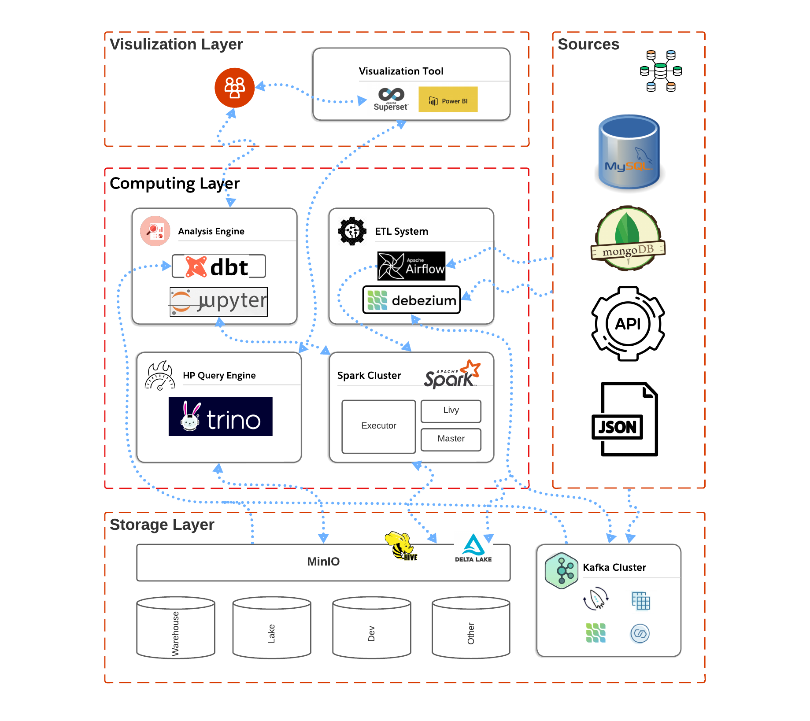

# Big Data Distributed System

In the era of data, create a robust big data system using `JupyterLab`, `Airflow`, `Spark`, `Trino`, `Superset`, `MinIO`, `Kafka`, `Debezium`, and `Delta Lake`. Explore storage, analytics, and computing layers for cutting-edge capabilities.

## Objective
The goal of this project is to create a distributed data system capable of processing and analyzing large datasets from multiple sources and providing comprehensive reporting and data visualization for end-users.

##  Table of Contents
1. [Objective](#objective)
2. [Developing Components for the Big Data System](./documents/developer.md)
5. [Visualization Layer](./documents/visualization.md)
6. [Computing Layer](./documents/computing.md)
7. [Storage Layer](./documents/storage.md)
