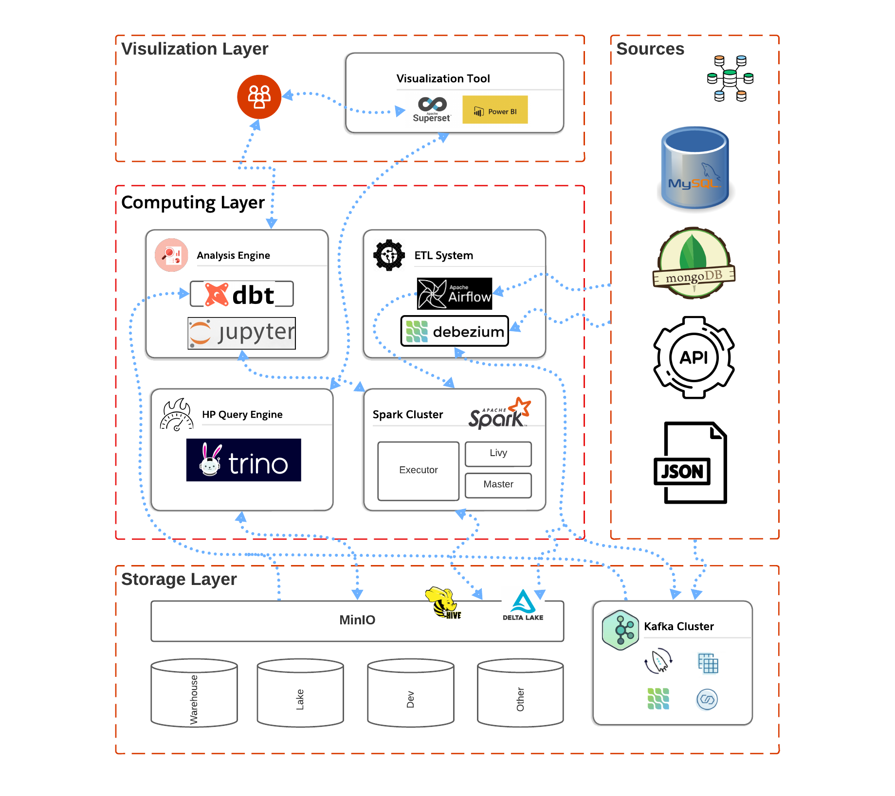

# Big Data Distributed System

In the era of data, create a robust big data system using `JupyterLab`, `Airflow`, `Spark`, `Trino`, `Superset`, `MinIO`, `Kafka`, `Debezium`, and `Delta Lake`. Explore storage, analytics, and computing layers for cutting-edge capabilities.

## Objective
The goal of this project is to create a distributed data system capable of processing and analyzing large datasets from multiple sources and providing comprehensive reporting and data visualization for end-users.

##  Table of Contents
1. [Objective](#objective)
2. [Data Pipeline Architecture](#data-pipeline-architecture)
3. [Developing Components for the Big Data System](./documents/developer.md)
4. [Visualization Layer](./documents/visualization.md)
5. [Computing Layer](./documents/computing.md)
6. [Storage Layer](./documents/storage.md)

## Data Pipeline Architecture

The data platform comprises three main layers: Storage, Computing, and Visualization. A comprehensive diagram of the Data Pipeline is presented below.

### Storage Layer

The Storage Layer incorporates Kafka and MinIO (Object Storage), utilized for storing raw data originating from user events, backend logs, third-party raw data, and more. 

### Computing Layer

The Computing Layer encompasses four essential components: HP Query Engine, Analysis Engine, ETL System, and Spark Cluster (Executor Engine).

- **High-Performance Query Engine:** Utilizing tools such as Trino, Presto, and similar software designed for efficient access and processing of data from databases or storage systems. This component optimizes speed and resource utilization for analytics tools in batch data processing.

- **ETL System:** The ETL system is used to extract data from various sources and load it into the data storage system (data lake) through scheduled and managed data processing tasks.

- **Analysis Engine:** Comprising tools like Jupyter Notebook, DBT, and others facilitating the development of data processing and transformation pipelines for engineers.

- **Spark Cluster (Executor Engine):** Assisting in executing data processing and distributed computing tasks, including batch and streaming for real-time support, enabling live streaming and real-time data analytics.

### Visualization Layer

The Visualization layer consists of tools that aid in visualizing data from the storage layer in the form of tables, charts, and more to make data easily understandable for users. These tools include Superset, PowerBI, and others.

## Team Members

- **Duy Nguyen** - `Data Engineer` - duynguyenngoc@hotmail.com