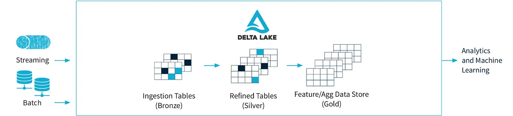
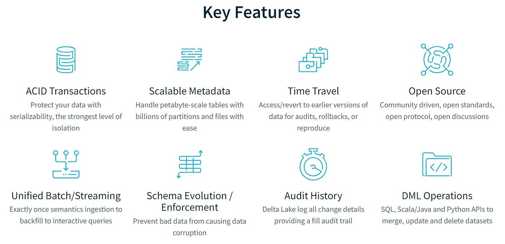

# An Introduction to Delta Lake and Performance Testing Data Processing with Apache Spark



Delta Lake là một lớp lưu trữ mã nguồn mở, mang đến giao dịch ACID (đề cập bên dưới), bảo vệ schema và xử lý khối công việc dữ liệu lớn. Delta Lake được thiết kế để cải thiện và mở rộng các tính năng của Apache Spark, đặc biệt là trong việc xử lý dữ liệu lớn, chịu tải cao và thực hiện các thao tác dữ liệu cùng lúc (concurrency). 

Điều này cho phép Delta Lake hỗ trợ việc đọc và ghi đồng thời (concurrent read-write), điều mà các định dạng lưu trữ dữ liệu truyền thống không hỗ trợ. Một số tính năng và lợi ích chính của Delta Lake bao gồm:




### 1. Giao dịch ACID

Delta Lake hỗ trợ các giao dịch ACID (Atomicity, Consistency, Isolation, Durability) để đảm bảo tính toàn vẹn và đáng tin cậy của dữ liệu trong quá trình xử lý. 

ACID là viết tắt của Atomicity (Nguyên tố), Consistency (Nhất quán), Isolation (Độc lập) và Durability (Bền vững). Đây là các tính năng quan trọng của hệ thống quản lý cơ sở dữ liệu (DBMS) để đảm bảo tính toàn vẹn và đáng tin cậy của dữ liệu trong quá trình thực hiện các giao dịch.

> EX: Giả sử bạn có một bảng lưu trữ dữ liệu về đơn hàng của khách hàng trong Delta Lake. Cần thực hiện một số tác động như thêm một mới vào bảng này, sửa đổi, xoá bỏ và cập nhật số lượng sản phẩm trong kho hàng và cập nhật tổng số tiền bán hàng.
- **Một giao dịch được xem là Atomicity (Nguyên tố):** Tức là nó được thực hiện hoàn toàn hoặc không thực hiện gì cả. Nếu một phần của giao dịch thất bại, toàn bộ giao dịch sẽ bị hủy và dữ liệu sẽ được trả về trạng thái ban đầu.
    - Thêm đơn hàng và cập nhật số lượng sản phẩm trong kho, tổng tiền bán hàn. Nếu lỗi thì toàn bộ giao dịch sẽ bị hủy và dữ liệu sẽ trở về trạng thái ban đầu. Đảm bảo rằng dữ liệu không bị ảnh hưởng bởi các giao dịch thất bại.

- **Consistency (Nhất quán):** Sau khi một giao dịch hoàn thành, dữ liệu phải ở trong trạng thái nhất quán, tức là phải đáp ứng các ràng buộc và quy tắc đã được xác định trước. Điều này đảm bảo rằng dữ liệu không bị lỗi hoặc vi phạm các quy tắc của hệ thống.

    - Ví Dụ: A và B cùng sửa dữ liệu của đơn hàng ```DH001``` là 100 và 120 nếu đang chọn cơ chế giải quyết xung đột mặc định (Timestamp-Based Ordering) và B có `timestamp` lớn hơn thì giá trị cuối cùng là 120.
    - Một số cơ chế giải quyết xung đột khác: **Version Numbering, External Logic, Custom Conflict Resolution**

- **Isolation (Độc lập):** Độc lập có nghĩa là mỗi giao dịch được thực hiện một cách độc lập mà không bị ảnh hưởng bởi các giao dịch khác đang diễn ra đồng thời. Điều này đảm bảo tính nhất quán của dữ liệu khi có nhiều người dùng truy cập và thay đổi cùng một lúc.

- **Durability (Bền vững):** Sau khi giao dịch hoàn thành, dữ liệu được ghi vào lưu trữ là bền vững và không bị mất đi do lỗi phần cứng hoặc phần mềm. Dữ liệu đã lưu trữ sẽ được giữ nguyên trạng thái ngay cả khi hệ thống gặp sự cố.

    - Delta Lake sử dụng Write-Ahead Log để ghi lại tất cả các thay đổi dữ liệu trước khi thực hiện ghi (write) chúng vào bảng

### 2. Bảo vệ Schema

Delta Lake bảo vệ một schema nghiêm ngặt cho dữ liệu, đảm bảo tính nhất quán và đáng tin cậy của cấu trúc dữ liệu. Điều này đảm bảo rằng bất kỳ thay đổi nào đối với schema (cấu trúc dữ liệu) đều phải có cơ chế rõ ràng và quản lý một cách kiểm soát. Các cơ chế bảo vệ schema trong Delta Lake bao gồm:
- **Schema Evolution:** Thay đổi schema của bảng một cách linh hoạt và kiểm soát. Điều này giúp bạn cập nhật schema một cách an toàn mà không phải thực hiện việc xóa và tạo lại bảng, từ đó giữ được dữ liệu đã có trong bảng và đảm bảo tính nhất quán.

    ```root
    |-- phone: string
    ```

    Thêm `email` vào bảng mà không làm mất đi dữ liệu đã có mặc định là `null`

- **Schema Enforcement:** Chỉ những dữ liệu tuân theo schema đã định nghĩa mới được ghi vào bảng

    ```yaml
    //Schema
    |-- phone: string
    |-- email: string

    //Data:
    {"phone": "0123456789", "email": "abc@xyz"} // hợp lệ
    {"phone": "0123456789", "email": "abc@xyz", "gender": "X"} // không hợp lệ
    ```

- **Schema Validation:** Tính năng Schema Validation trong Delta Lake giúp xác thực kiểu dữ liệu của dữ liệu trước khi ghi vào bảng. Điều này giúp đảm bảo tính hợp lệ của dữ liệu và tránh các lỗi không đáng có. Ví Dụ: Dữ liệu mới phải tuân theo kiểu dữ liệu đã xác định trong schema trước khi được ghi vào bảng.

    ```yaml
    // Schema
    |-- employee_id: integer
    |-- name: string

    //Data:
    {"employee_id": 1, "name": "Apot"} // hợp lệ
    {"employee_id": 2, "name": 3333} // không hợp lệ
    ```

### 3. Time Travel

Delta Lake cho phép bạn truy cập và khám phá lịch sử của dữ liệu trong bảng. Nó cho phép bạn xem lại các phiên bản trước đó của dữ liệu, quay lại thời điểm trước đó và thậm chí khôi phục lại dữ liệu từ các phiên bản trước đó. 

Giả sử bạn có bảng `sales_data` trong Delta Lake và đã thêm và cập nhật dữ liệu trong bảng theo thời gian. Bạn muốn xem lại dữ liệu của bảng vào một thời điểm cụ thể trong quá khứ:

```python
// Đọc dữ liệu bảng "sales_data" tại một thời điểm trong quá khứ (delta 1)
val version1DF = spark.read.format("delta").option("versionAsOf", 1).load("/path/to/sales_data")

// Đọc dữ liệu bảng "sales_data" tại một thời điểm khác trong quá khứ (delta 2)
val version2DF = spark.read.format("delta").option("versionAsOf", 2).load("/path/to/sales_data")
``` 

Bạn cũng có thể khôi phục lại dữ liệu từ các phiên bản trước đó bằng cách sử dụng các công cụ như ```RESTORE``` hoặc ```MERGE INTO``` để quay lại các phiên bản trước đó của dữ liệu.

### 4. Tối ưu hoá hiệu xuất

Delta Lake cung cấp nhiều tính năng và cơ chế tối ưu hóa để cải thiện hiệu suất và hiệu quả trong việc xử lý dữ liệu. Dưới đây là một số tính năng chính giúp tối ưu hóa hiệu suất trong Delta Lake:

- **Optimized Writes (Ghi tối ưu hóa):** Delta Lake sử dụng cơ chế ghi tối ưu hóa để cải thiện hiệu suất ghi dữ liệu. Khi bạn thêm mới, cập nhật hoặc xoá bỏ dữ liệu, Delta Lake chỉ ghi lại những phần dữ liệu thay đổi thực sự, thay vì ghi toàn bộ tập dữ liệu. Điều này giúp giảm thời gian ghi và tiết kiệm tài nguyên lưu trữ.

    EX: Cập nhật bảng:

    ```yaml
    customer_id|customer_name|age|address|last_updated
    -------------------------------------------------
    C001       |John Doe     |30 |123 St.|2023-08-01 12:00:00
    C002       |Jane Smith   |25 |456 Ave|2023-08-01 12:05:00
    C003       |Mike Johnson |40 |789 Rd.|2023-08-01 12:10:00

    // Cần cập nhật -> chỉ ghi lại phần dữ liệu này
    C002       |Jane Doe     |26 |456 Ave|2023-08-01 14:00:00
    ```
- **Z-Ordering (Sắp xếp Z):** Z-Ordering là một cơ chế sắp xếp dữ liệu dựa trên các cột cụ thể để cải thiện hiệu suất đọc. Bằng cách sắp xếp dữ liệu theo các cột thường xuyên được sử dụng trong các truy vấn, Delta Lake giảm thiểu việc truy cập đĩa và tăng tốc độ đọc dữ liệu.

    EX: Giả sử bạn có bảng ```sales_data``` trong Delta Lake với các cột sau:

    ```yaml
    customer_id | product_id | quantity | timestamp
    ----------------------------------------------
    C001        | P001       | 50       | 2023-08-01 12:00:00
    C002        | P002       | 30       | 2023-08-01 12:05:00
    C003        | P003       | 20       | 2023-08-01 12:10:00
    C004        | P004       | 40       | 2023-08-01 12:15:00
    ```
    Nếu bạn muốn sắp xếp dữ liệu trong Delta Lake dựa trên cột ```timestamp```, Delta Lake sẽ tổ chức lại dữ liệu trong các tệp Delta sao cho các dòng dữ liệu có giá trị của cột "timestamp" gần nhau được gom nhóm lại trong cùng một vị trí trên đĩa.
    
    ```yaml
    Tệp Delta 1:
    ----------------------------------------------
    customer_id | product_id | quantity | timestamp
    ----------------------------------------------
    C001        | P001       | 50       | 2023-08-01 12:00:00
    C002        | P002       | 30       | 2023-08-01 12:05:00

    Tệp Delta 2:
    ----------------------------------------------
    customer_id | product_id | quantity | timestamp
    ----------------------------------------------
    C003        | P003       | 20       | 2023-08-01 12:10:00
    C004        | P004       | 40       | 2023-08-01 12:15:00
    ```
- **Data Skipping (Bỏ qua dữ liệu):** Delta Lake sử dụng cơ chế Data Skipping để giảm số lượng dòng phải quét khi thực hiện các truy vấn. Khi có điều kiện truy vấn không phù hợp với dữ liệu, Delta Lake sẽ bỏ qua các phần dữ liệu không cần thiết, giúp tăng tốc độ truy vấn.
    
    EX: Áp dụng dữ liệu phía trên với cột ```timestamp``` đã có thông tin trong metadata:
    
    ```yaml
    Delta Table: sales_data
    Siêu dữ liệu:
    ---------------------------------------------
    Tệp Delta 1: 12345.delta
    ---------------------------------------------
    Vị trí: /path/to/delta_table_location/12345.delta
    Số lượng dòng: 2
    Các giá trị của cột timestamp trong tệp: 2023-08-01 12:00:00, 2023-08-01 12:05:00

    Tệp Delta 2: 67890.delta
    ---------------------------------------------
    Vị trí: /path/to/delta_table_location/67890.delta
    Số lượng dòng: 2
    Các giá trị của cột timestamp trong tệp: 2023-08-01 12:10:00, 2023-08-01 12:15:00
    ```
    ```sql
    SELECT customer_id FROM sales_data WHERE timestamp >= '2023-08-01 12:00:00' AND timestamp <= '2023-08-01 12:09:00'
    ```
    
    Thì deltalake chỉ quét dữ liệu từ `Tệp Delta 1` giúp giảm thiểu việc truy cập đĩa và tăng tốc độ truy vấn.
- **Compaction (Tối ưu dữ liệu):** Delta Lake thực hiện quá trình compact để tổ chức lại và giảm kích thước dữ liệu. Quá trình compact giúp cải thiện hiệu suất đọc dữ liệu và giảm dung lượng lưu trữ. Khi bạn thực hiện các hoạt động ghi dữ liệu trong Delta Lake, các dòng dữ liệu mới sẽ được ghi vào các tệp Delta mới. Điều này có thể dẫn đến việc có nhiều tệp dữ liệu nhỏ, làm cho việc đọc dữ liệu trở nên chậm và tốn nhiều tài nguyên lưu trữ. 
    + Nó thực hiện tự động dựa theo configuration or manual với lệnh `OPTIMIZE`. 
    + Quy tắc Compaction gồm 2 cấu hình Quy tắc Số lượng tệp (File Size Rule) ngưỡng dung lượng các tệp Delta, Quy tắc Thời gian (Time-based Rule) thời gian tối thiểu giữa các lần thực hiện Compaction.
    + Cấu hình tại: `/path/to/delta/tables/<table_name>/_delta_log/delta.properties`
    + Giá trị mặc định của cả hai tùy chọn này là null, điều này có nghĩa là mặc định Delta Lake sẽ không áp dụng Compaction tự động. 

    ```yaml
    // Ví dụ 
    // Cấu hình dung lượng cho phép là 1GB
    // Thời gian tối thiểu giữa các lần thực hiện Compaction là 1 ngày
    compaction.fileSizeLimit = 1073741824   # 1GB
    compaction.minTimeBetweenRuns = 1d      # 1 day
    ```

- **Predicate Pushdown (Tối ưu truy vấn):** Delta Lake hỗ trợ Predicate Pushdown, cho phép các điều kiện truy vấn được đẩy xuống tầng dữ liệu, giúp giảm số lượng dòng phải quét và cải thiện hiệu suất truy vấn.
    + Ngoài dữ liệu metadata có đc từ việc sử dụng `Z-Ordering` như đã đề cập phía trên. Khi bạn thực hiện các câu truy vấn phân tích hoặc các hoạt động thay đổi dữ liệu trên Delta Lake sẽ được tự động lưu vào `Transaction Logs`, Delta Lake tự động cập nhật thông tin thống kê như số lượng dòng, giá trị tối thiểu, tối đa, v.v.. vào `metadata`, Từ dó Predicate Pushdown sữ dụng thông tin này để tối ưu truy vấn.
    + `Transaction Logs` đc lưu tại `/path/to/delta_table/.delta`
    + Để giảm tải dung lương `Transaction Logs` vì lưu quá nhiều thông tin DeltaLake sử dụng Vacuum bằng cách xóa các phiên bản cũ không còn cần thiết không còn nằm trong khoảng thời gian giữ lại được configuration.

- **Caching (Lưu cache):** Delta Lake hỗ trợ caching dữ liệu để giữ lại kết quả truy vấn trước đó trong bộ nhớ cache. Việc lưu cache giúp truy vấn lần sau nhanh hơn và giảm thời gian thực thi.
    + Cache của Apache Spark. Khi bạn thực hiện một truy vấn trên Delta Lake, kết quả của truy vấn đó có thể được lưu trữ trong bộ nhớ cache của Spark. Khi có các truy vấn sau đó cần truy cập cùng dữ liệu hoặc tương tự truy vấn trước đó, Spark sẽ sử dụng kết quả được lưu trữ trong bộ nhớ cache thay vì thực hiện truy vấn từ đầu.
    + Để sử dụng tính năng caching trong Delta Lake, bạn có thể sử dụng các câu lệnh Spark SQL như `CACHE TABLE` hoặc `UNCACHE TABLE` để lưu cache hoặc xóa cache cho các bảng dữ liệu.
    
- **Concurrency Control (Kiểm soát đồng thời):** Delta Lake hỗ trợ kiểm soát đồng thời cho các giao dịch và truy vấn, cho phép nhiều người dùng truy cập và thao tác dữ liệu một cách an toàn và đồng thời.
    + **Transaction Concurrency:** Khi có nhiều giao dịch được thực hiện cùng lúc, Delta Lake sẽ áp dụng các cơ chế kiểm soát đồng thời như khoá dòng (row-level locking) và khoá phiên (session-level locking) để đảm bảo rằng mỗi giao dịch có quyền thực hiện thay đổi trên các dòng dữ liệu một cách an toàn.
    
        ```sql
        <!-- Giao dịch thứ nhất (Transaction 1): -->
        UPDATE order_data
        SET quantity = 100
        WHERE order_id = 'OD001';

        <!-- Giao dịch thứ hai (Transaction 2): -->
        DELETE FROM order_data
        WHERE order_id = 'OD001';

        <!-- Trong trường hợp này, giao dịch thứ hai sẽ phải chờ cho đến khi giao  -->
        <!-- dịch thứ nhất hoàn thành để thực hiện xoá bỏ đơn hàng. Điều này giúp -->
        <!-- tránh xung đột giữa hai giao dịch và đảm bảo rằng dữ liệu cuối cùng  -->
        <!-- sẽ được duy trì đúng như mong đợi. -->
        ```
    + **Query Concurrency:** Delta Lake cũng hỗ trợ kiểm soát đồng thời cho các truy vấn, đảm bảo rằng các truy vấn được thực hiện đồng thời không xung đột với nhau và không gây ra hiện tượng đọc "dữ liệu bẩn" (dirty read) hoặc "đọc không nhất quán" (non-repeatable read).


- **File Optimization (Tối ưu tập tin):** Delta Lake sử dụng cơ chế ghi lại các thay đổi dữ liệu vào các tập tin `Parquet` cỡ nhỏ để cải thiện hiệu suất đọc và viết dữ liệu. Hoặc là tối ưu thông qua `Compaction` đã được đề cập phía trên. Một vài tập tin được lưu dưới dạng parguet như:
    + **Delta Log:** Delta Lake duy trì một bản ghi gọi là "Delta Log" (hay Transaction Log) được lưu trữ trong các tập tin Parquet cỡ nhỏ và tối ưu.
    + **Write Ahead Log (WAL):**  Khi thực hiện các giao dịch ghi dữ liệu, Delta Lake sử dụng Write Ahead Log (WAL) để ghi lại các thay đổi dữ liệu trước khi áp dụng vào các tập tin Parquet.
    
### 5. Tích hợp Batch và Stream
Delta Lake hỗ trợ cả xử lý dữ liệu lô và dữ liệu luồng, cung cấp một giải pháp thống nhất cho các khối công việc thời gian thực và lô.

- **Batch Processing (Xử lý dữ liệu lô):** Cho phép bạn thực hiện các công việc xử lý dữ liệu lô truyền thống như ETL (Extract, Transform, Load), batch analytics, và các công việc phân tích dữ liệu lớn. 

    EX: CSV chứa dữ liệu về các giao dịch mua hàng từ các khách hàng trong một khoảng thời gian cụ thể. Bạn muốn xử lý dữ liệu này để tính tổng số tiền bán hàng từng khách hàng và lưu kết quả vào một bảng mới.

    ```python
    # Load data from CSV into a DataFrame
    df = spark.read.csv("transactions.csv", header=True, inferSchema=True)

    # Perform data transformation - calculate total sales per customer
    total_sales = df.groupBy("customer_id").sum("total_amount")

    # Save the result into Delta Lake table
    total_sales.write.format("delta").save("/data/total_sales")
    ```

- **Stream Processing (Xử lý dữ liệu luồng):** Hỗ trợ xử lý dữ liệu luồng với Apache Spark Structured Streaming. Bằng cách sử dụng Delta Lake với Spark Structured Streaming, bạn có thể xử lý dữ liệu đến từ các nguồn dữ liệu luồng như Kafka, Kinesis, hay những dữ liệu luồng real-time khác.

    EX: Giả sử bạn có một luồng dữ liệu real-time từ nguồn Kafka chứa thông tin về việc mua hàng của khách hàng. Bạn muốn xử lý dữ liệu này trong thời gian thực để tính tổng số tiền bán hàng từng khách hàng và lưu kết quả vào một bảng mới.

    ```python
    # Load streaming data from Kafka into a DataFrame
    df = spark.readStream.format("kafka").option("kafka.bootstrap.servers", "localhost:9092").option("subscribe", "transactions_topic").load()

    # Perform data transformation - calculate total sales per customer
    total_sales = df.groupBy("customer_id").sum("total_amount")

    # Save the streaming result into Delta Lake table
    streaming_query = total_sales.writeStream.format("delta").outputMode("update").option("checkpointLocation", "/checkpoint/total_sales").start("/data/total_sales")
    streaming_query.awaitTermination()

    # Lưu ý rằng trong xử lý dữ liệu luồng, chúng ta sử dụng writeStream 
    # thay vì write và cần cung cấp một vị trí lưu trữ checkpoint để theo 
    # dõi trạng thái của truy vấn luồng.
    ```